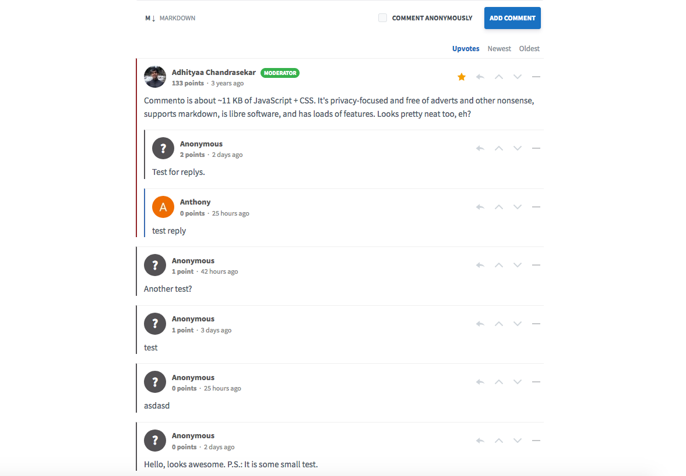

<!--
N.B.: This README was automatically generated by https://github.com/YunoHost/apps/tree/master/tools/README-generator
It shall NOT be edited by hand.
-->

# Commento pour YunoHost

[](https://dash.yunohost.org/appci/app/commento)  

[](https://install-app.yunohost.org/?app=commento)

*[Read this readme in english.](./README.md)*

> *Ce package vous permet d’installer Commento rapidement et simplement sur un serveur YunoHost.
Si vous n’avez pas YunoHost, regardez [ici](https://yunohost.org/#/install) pour savoir comment l’installer et en profiter.*

## Vue d’ensemble

Commento++ allows you to foster discussion on your website – if you have a blog, you can embed Commento if you want your readers to add comments. It's fast and bloat-free, has a modern interface, and is reasonably secure. Unlike most alternatives, Commento is lightweight and privacy-focused.

### Features

- Markdown support
- Import from Disqus
- Voting
- Automated spam detection (Askimet integration)
- Moderation tools
- Sticky comments
- Thread locking
- OAuth login (Google, Github, Twitter) and single sign-on
- Hot-reloading of comments
- Email notifications.


**Version incluse :** 1.8.7~ynh1

**Démo :** https://demo.souradip.com/chat.html

## Captures d’écran



## Documentations et ressources

* Site officiel de l’app : <https://commento.io/>
* Documentation officielle de l’admin : <https://docs.commento.io/>
* Dépôt de code officiel de l’app : <https://github.com/souramoo/commentoplusplus>
* Documentation YunoHost pour cette app : <https://yunohost.org/app_commento>
* Signaler un bug : <https://github.com/YunoHost-Apps/commento_ynh/issues>

## Informations pour les développeurs

Merci de faire vos pull request sur la [branche testing](https://github.com/YunoHost-Apps/commento_ynh/tree/testing).

Pour essayer la branche testing, procédez comme suit.

``` bash
sudo yunohost app install https://github.com/YunoHost-Apps/commento_ynh/tree/testing --debug
ou
sudo yunohost app upgrade commento -u https://github.com/YunoHost-Apps/commento_ynh/tree/testing --debug
```

**Plus d’infos sur le packaging d’applications :** <https://yunohost.org/packaging_apps>